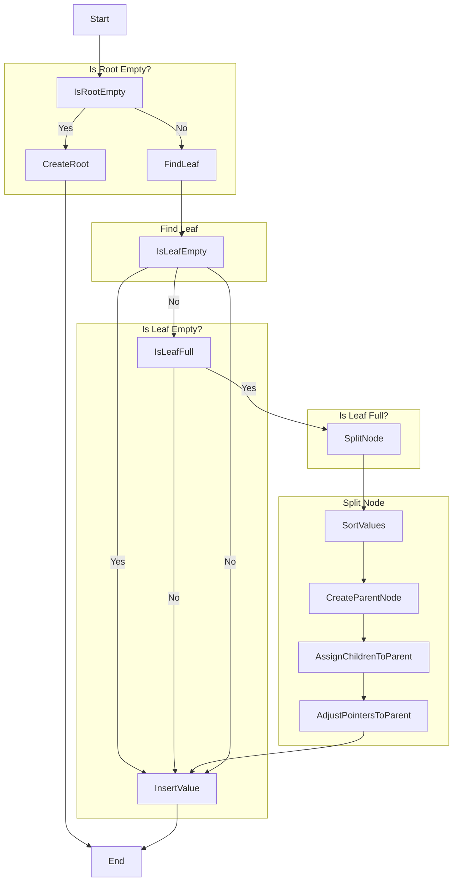

```mermaid
flowchart TD
    Start --> IsRootEmpty
    subgraph Is Root Empty?
        IsRootEmpty -->|Yes| CreateRoot
        IsRootEmpty -->|No| FindLeaf
    end
    CreateRoot --> End
    subgraph Find Leaf
        FindLeaf --> IsLeafEmpty
    end
    subgraph Is Leaf Empty?
        IsLeafEmpty -->|Yes| InsertValue
        IsLeafEmpty -->|No| IsLeafFull
    end
    InsertValue --> End
    subgraph Is Leaf Full?
        IsLeafFull -->|Yes| SplitNode
        IsLeafFull -->|No| InsertValue
    end
    subgraph Split Node
        SplitNode --> SortValues
        SortValues --> CreateParentNode
        CreateParentNode --> AssignChildrenToParent
        AssignChildrenToParent --> AdjustPointersToParent
    end
    AdjustPointersToParent --> InsertValue
    IsLeafEmpty -->|No| InsertValue
```
