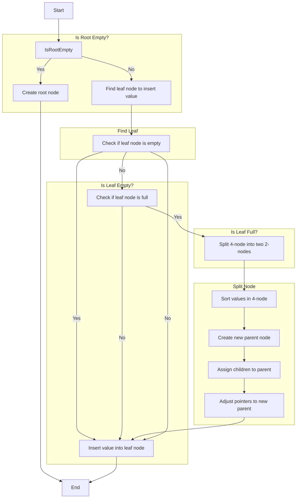

```mermaid
flowchart TD
    Start --> IsRootEmpty
    subgraph Is Root Empty?
        IsRootEmpty -->|Yes| CreateRoot
        IsRootEmpty -->|No| FindLeaf
        CreateRoot[Create root node]
        FindLeaf[Find leaf node to insert value]
    end
    CreateRoot --> End
    subgraph Find Leaf
        FindLeaf --> IsLeafEmpty
        IsLeafEmpty[Check if leaf node is empty]
    end
    subgraph Is Leaf Empty?
        IsLeafEmpty -->|Yes| InsertValue
        IsLeafEmpty -->|No| IsLeafFull
        InsertValue[Insert value into leaf node]
        IsLeafFull[Check if leaf node is full]
    end
    InsertValue --> End
    subgraph Is Leaf Full?
        IsLeafFull -->|Yes| SplitNode
        IsLeafFull -->|No| InsertValue
        SplitNode[Split 4-node into two 2-nodes]
    end
    subgraph Split Node
        SplitNode --> SortValues
        SortValues --> CreateParentNode
        CreateParentNode --> AssignChildrenToParent
        AssignChildrenToParent --> AdjustPointersToParent
        SortValues[Sort values in 4-node]
        CreateParentNode[Create new parent node]
        AssignChildrenToParent[Assign children to parent]
        AdjustPointersToParent[Adjust pointers to new parent]
    end
    AdjustPointersToParent --> InsertValue
    IsLeafEmpty -->|No| InsertValue

```
